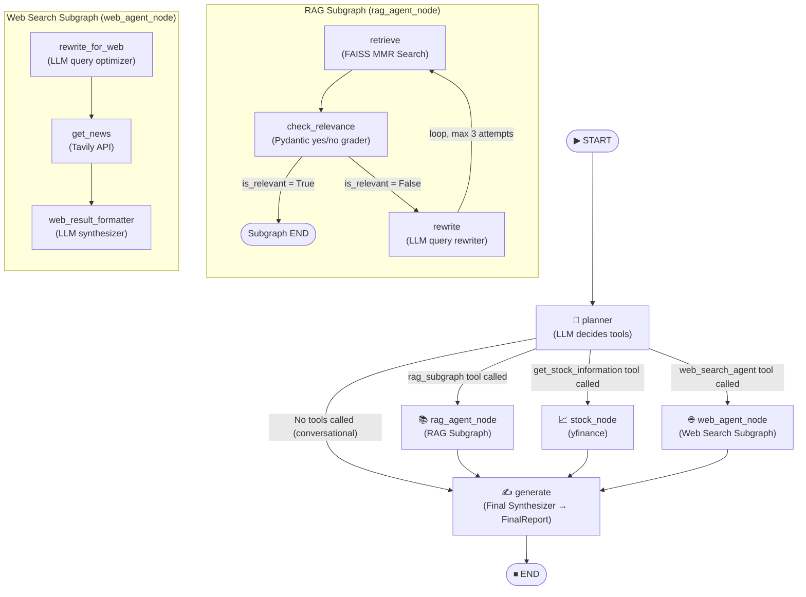

# FinSight Agentic RAG — Full System Documentation

> **Report generated by AI.**
> This document was produced by an AI assistant after performing a full traversal and deep inspection of the `Agentic_RAG` project codebase. It is intended to give a future LLM or developer complete, self-contained context about the system architecture, design decisions, data flows, and every individual component. No assumptions are made — everything stated below is directly derived from the actual source code.

---

## 1. Executive Overview

**Agentic_RAG** is a multi-agent financial AI assistant built using **LangGraph** (a stateful, graph-based orchestration framework built on top of LangChain). It answers complex financial research queries by intelligently coordinating between three distinct, heterogeneous data sources in parallel:

| Data Source | Technology | What it provides |
|---|---|---|
| **Wells Fargo 2025 Annual Report** | FAISS Vector DB + HuggingFace Embeddings | Historical financial data, income statements, risk sections |
| **Live Stock Market** | Yahoo Finance (`yfinance`) | Real-time stock price, market cap, 52-week range, P/E ratio |
| **Live Web Search** | Tavily Search API | Recent news articles, CEO updates, general company events |

The system uses a **single shared LLM** (`model`) for all reasoning tasks, bound to different prompts and output parsers per node. The orchestrator decides, per query, which subset of the three data sources to activate — including activating all three simultaneously in parallel (fan-out).

---

## 2. Technology Stack

| Layer | Technology |
|---|---|
| Graph Orchestration | LangGraph (`StateGraph`) |
| LLM Provider | Pluggable — Groq (Llama / Gemma / Mixtral) or Google Gemini |
| LLM Abstraction | LangChain (`langchain-core`, `langchain-google-genai`, `langchain-groq`) |
| Vector Database | FAISS (Facebook AI Similarity Search), loaded via `langchain-community` |
| Embeddings | `BAAI/bge-small-en-v1.5` via `langchain-huggingface` |
| Web Search | Tavily (`tavily-python`) |
| Stock Data | `yfinance` |
| Structured Output | Pydantic v2 (`BaseModel`) |
| Entry Point | Plain Python REPL loop (`main.py`) |

---

## 3. System Graph Topology

The diagram below shows the complete execution flow of the master orchestrator and its two compiled subgraphs.



> **Fan-Out:** The router returns a list of node names from `route_from_planner`, causing LangGraph to launch those nodes **concurrently in the same step** — all three branches can run in parallel.
>
> **Fan-In:** All three branches wire directly to `generate`. LangGraph waits for every active branch to complete before firing `generate`, merging their shared state updates using the `merge_values` reducer.

---

## 4. Repository File Map

```
Agentic_RAG/
│
├── main.py                              # Application entry point (REPL loop + graph streaming)
├── draw_graph.py                        # Utility: renders the LangGraph topology as a PNG
│
├── faiss_data/
│   └── faiss_wells_fargo_index.*        # Pre-built FAISS index of the WF 2025 Annual Report
│
├── utils/
│   └── format_document_list.py         # Helper: converts a list of LangChain Documents to a string
│
└── agent/
    ├── core/
    │   ├── model.py                     # Singleton LLM instance, provider-agnostic
    │   ├── shared_state.py             # MASTER shared state TypedDict (MessagesState)
    │   └── pydantic_models/
    │       ├── report_model.py          # FinalReport: structured output schema for generator
    │       └── relevance_response_model.py  # RelevanceResponse: yes/no relevance grader schema
    │
    ├── tools/
    │   └── stock_info.py               # @tool: yfinance wrapper returning live stock metrics
    │
    ├── orchestrator/
    │   ├── prompt.py                    # PLANNER_SYSTEM_PROMPT + GENERATE_SYSTEM_PROMPT
    │   ├── core/
    │   │   └── graph.py                 # Master StateGraph assembly and compilation
    │   └── nodes/
    │       ├── planner.py               # Node: LLM decides tools + writes queries into state
    │       ├── router.py                # Conditional edge: fans out to 1-3 parallel branches
    │       ├── stock.py                 # Node: manually runs stock tool + patches ToolMessage ID (AI-Generated)
    │       └── generate.py              # Node: final LLM synthesis → FinalReport Pydantic object
    │
    └── subgraphs/
        ├── rag_agent/
        │   ├── prompts.py               # RELEVANCE_SYSTEM_PROMPT, REWRITE_QUERY_SYSTEM_PROMPT, etc.
        │   ├── core/
        │   │   └── graph.py             # RAG subgraph: retrieve → relevance → (rewrite loop) → END
        │   └── nodes/
        │       ├── retrieve.py          # Node: MMR search on FAISS vector store
        │       ├── relevance.py         # Node: Pydantic-graded yes/no relevance check
        │       ├── rewrite.py           # Node: LLM rewrites rag_query for better retrieval
        │       └── should_rewrite.py    # Conditional edge: routes to rewrite or exits subgraph
        │
        └── web_search_agent/
            ├── prompts.py               # WEB_REWRITE_SYSTEM_PROMPT, WEB_SYNTHESIS_SYSTEM_PROMPT
            ├── core/
            │   └── graph.py             # Web subgraph: rewrite_for_web → get_news → format → END
            └── nodes/
                ├── rewrite_for_web.py   # Node: LLM optimizes Tavily search query
                ├── search_web.py        # Node: Tavily API call → raw news_data string
                └── web_result_formatter.py  # Node: LLM synthesizes news into markdown string
```

---

## 4. Master State Schema (`agent/core/shared_state.py`)

This is the most architecturally critical file. LangGraph passes a **single shared state dictionary** between every node in the graph. If a key is not declared here, LangGraph **silently discards it** after each step transition — this was a major source of bugs in early development.

```python
class MessagesState(TypedDict):
    messages: Annotated[List[BaseMessage], add_messages]   # Append-only chat history
    user_query: Annotated[str, merge_values]               # Original user input (never modified)
    rag_query: Annotated[str, merge_values]                # Query for FAISS (rewritten by RAG subgraph)
    tavily_query: Annotated[str, merge_values]             # Query for Tavily (rewritten by Web subgraph)
    document_chunks: Annotated[List[Any], merge_values]    # Retrieved FAISS document objects
    is_relevant: Annotated[bool, merge_values]             # Relevance grader output
    rewrite_count: Annotated[int, merge_values]            # RAG retry counter (max 3)
    news_data: Annotated[str, merge_values]                # Raw Tavily results string
    news_data_formatted: Annotated[str, merge_values]      # LLM-formatted web news
    stock_info: Annotated[dict, merge_values]              # Live stock metrics dict from yfinance
    final_report: Annotated[FinalReport, merge_values]     # Final Pydantic output object
```

**Key Design Decision — `merge_values` reducer:**
```python
def merge_values(left: Any, right: Any) -> Any:
    return right if right is not None else left
```
Because three branches run in **parallel** (rag, stock, web), they all write to the same shared state at the same time. Without a reducer, LangGraph raises an `InvalidUpdateError` for any key that receives more than one update per "step." The `merge_values` reducer resolves this by accepting the newest non-None value, enabling all parallel branches to write safely.

`messages` uses LangGraph's built-in `add_messages` reducer, which appends new messages instead of overwriting the list.

---

## 5. Master Orchestrator Graph (`agent/orchestrator/core/graph.py`)

The main graph has 5 nodes connected with standard and conditional edges:

```python
main_agent_builder = StateGraph(state_schema=MessagesState)

main_agent_builder.add_node("planner",       planner)
main_agent_builder.add_node("generate",      generate)
main_agent_builder.add_node("rag_agent_node", rag_subgraph)      # compiled subgraph
main_agent_builder.add_node("web_agent_node", web_search_agent)  # compiled subgraph
main_agent_builder.add_node("stock_node",    stock_node)

main_agent_builder.add_edge(START, "planner")

# Conditional fan-out from planner
main_agent_builder.add_conditional_edges("planner", route_from_planner, {
    "rag_agent_node": "rag_agent_node",
    "stock_node":     "stock_node",
    "web_agent_node": "web_agent_node",
    "generate":       "generate"        # bypass if no tools needed
})

# All three branches converge to generate (fan-in)
main_agent_builder.add_edge("rag_agent_node", "generate")
main_agent_builder.add_edge("stock_node",     "generate")
main_agent_builder.add_edge("web_agent_node", "generate")
main_agent_builder.add_edge("generate",       END)

main_agent = main_agent_builder.compile()
```

**Fan-Out/Fan-In topology:** LangGraph's `add_conditional_edges` can return a **list** of node names, which causes those nodes to execute **concurrently in parallel**. All three nodes then converge to `generate` once all have completed.

---

## 6. Node-by-Node Breakdown

### 6.1 `planner` Node (`agent/orchestrator/nodes/planner.py`)

**Role:** The brain of the system. Reads the user query and decides which combination of the three tools to invoke.

**How it works:**
1. The model is bound to three tools: `rag_subgraph`, `web_search_agent`, `get_stock_information`.
2. The planner LLM is invoked with the full `PLANNER_SYSTEM_PROMPT` + the user's message history.
3. The LLM responds with one or more `tool_calls` in its response message.
4. The planner then **extracts the query arguments** from each tool call and writes them directly into the shared state:
   - `rag_subgraph(query=...)` → writes to `state["rag_query"]`
   - `web_search_agent(query=...)` → writes to `state["tavily_query"]`
   - `get_stock_information(ticker=...)` → writes `{"ticker": "AAPL"}` to `state["stock_info"]`

**Important note about tool definitions:**
```python
@tool
def rag_subgraph(query: str) -> str:
    """Searches the Wells Fargo 2025 Annual Report ..."""
    pass  # Body is intentionally empty — this is a "signal tool"

@tool
def web_search_agent(query: str) -> str:
    """Searches the web for recent news ..."""
    pass  # Body is intentionally empty — this is a "signal tool"
```
These are **dummy "signal" tools** — they exist only so the LLM can declare intent. The planner never executes their bodies. The actual RAG and Web subgraphs are invoked by the router as separate graph nodes.

**Planner System Prompt (verbatim routing rules):**
- Rule 1: Wells Fargo 2025 financials → use `rag_tool`
- Rule 2: Stock + news queries → use BOTH `get_stock_information` AND `web_tool` (forces parallel)
- Rule 3: General knowledge → use `web_tool`
- Rule 4: Conversational chat → use no tools, go directly to `generate`

---

### 6.2 `router` (`agent/orchestrator/nodes/router.py`)

**Role:** LangGraph conditional edge function. Reads the planner's tool calls and returns a list of node names to activate simultaneously.

```python
def route_from_planner(state: MessagesState):
    last_message = state["messages"][-1]
    
    # No tool calls = conversational bypass
    if not hasattr(last_message, 'tool_calls') or not last_message.tool_calls:
        return ["generate"]
    
    destinations = []
    for tool_call in last_message.tool_calls:
        if tool_call["name"] == "rag_subgraph":
            destinations.append("rag_agent_node")
        elif tool_call["name"] == "get_stock_information":
            destinations.append("stock_node")
        elif tool_call["name"] == "web_search_agent":
            destinations.append("web_agent_node")
    
    return destinations or ["generate"]
```

Returning a **list** from a conditional edge function is LangGraph's mechanism for parallel fan-out. If the planner called all three tools, all three graph nodes start executing concurrently in the same LangGraph "step."

---

### 6.3 `stock_node` (`agent/orchestrator/nodes/stock.py`)

> [!IMPORTANT]
> **This module was 100% AI-generated.** It does not follow the standard LangGraph `ToolNode` pattern and was custom-designed to bridge the gap between the planner's dynamic tool call IDs and the stock data state key.

**The Problem it Solves:**
LangGraph's standard `ToolNode` works by intercepting `tool_calls` from the last message and routing them to the correct tool function. However, because our RAG and Web tools are "signal-only" (empty bodies), using a standard `ToolNode` would fail or skip the stock tool invocation, and would not write to the custom `stock_info` state key that the `generate` node reads.

**Mechanism (step by step):**
```python
def stock_node(state: MessagesState):
    # Step 1: Get ticker from state (may have been pre-populated by planner)
    ticker = state.get("stock_info", {}).get("ticker")
    tool_call_id = None
    
    # Step 2: ALWAYS scan the planner's last message to extract the correct tool_call_id
    # This is critical — if the ID is wrong, the final LLM will reject the ToolMessage
    last_message = state["messages"][-1]
    if hasattr(last_message, 'tool_calls') and last_message.tool_calls:
        for tc in last_message.tool_calls:
            if tc["name"] == "get_stock_information":
                if not ticker:
                    ticker = tc.get("args", {}).get("ticker")
                tool_call_id = tc.get("id")  # Always captured, even if ticker was already set
                break
    
    if not ticker:
        return {"stock_info": {"error": "No ticker supplied"}}
    
    # Step 3: Invoke the yfinance tool directly
    result = get_stock_information.invoke({"ticker": ticker})
    
    # Step 4: Patch the ToolMessage's tool_call_id with the real planner ID
    tool_msg = result.get("messages", [None])[0]
    if tool_msg and tool_call_id:
        tool_msg.tool_call_id = tool_call_id
    
    # Step 5: Return updates for both messages (so the LLM sees a valid tool result)
    # and stock_info (so the generate node can format it into the report)
    return {
        "messages": [tool_msg] if tool_msg else [],
        "stock_info": result.get("stock_info", {})
    }
```

**Why the `tool_call_id` matters:** Commercial LLM APIs (Groq, OpenAI, Gemini) enforce a strict conversation protocol: every `AIMessage` that contains a `tool_call` must be followed by a `ToolMessage` whose `tool_call_id` exactly matches the ID in the `AIMessage`. If the IDs do not match, the API throws a `400 Bad Request`. The original implementation used a placeholder `"dummy_id"` in `stock_info.py`, so when all three tools fired concurrently, the ID mismatched and the stock data was silently ignored.

---

### 6.4 `generate` Node (`agent/orchestrator/nodes/generate.py`)

**Role:** The final synthesizer. Collects all gathered data from the shared state and invokes the LLM with the `GENERATE_SYSTEM_PROMPT` to produce a structured `FinalReport` Pydantic object.

**Data assembly:**
```python
docs      = state.get('document_chunks', [])     # From RAG subgraph
web_result = state.get('news_data_formatted', "No Web data requested")  # From Web subgraph
stock_info = state.get('stock_info', {})          # From stock_node

# Assembled into a single input string for the LLM
input = f"User Query: {user_query}\nRAG DATA: {doc_string}\nSTOCK INFO: {stock_info}\nWEB RESULT: {web_result}"
```

**Structured output:**
```python
generate_model = model.with_structured_output(schema=FinalReport)
```
`with_structured_output` causes LangChain to wrap the model call in a tool/function schema derived from the Pydantic model's JSON schema. The LLM must fill out all required fields before the chain resolves.

---

## 7. RAG Subgraph (`agent/subgraphs/rag_agent/`)

A fully self-contained `StateGraph` compiled as a child node (`rag_agent_node`) in the master graph.

### Flow
```
START → retrieve → check_relevance → should_rewrite (conditional)
                                           ↓ yes (relevant)
                                         END
                                           ↓ no (not relevant, rewrite_count < 3)
                                        rewrite → retrieve (loop)
```

### 7.1 `retrieve` Node

- Uses `HuggingFaceEmbeddings` with model `BAAI/bge-small-en-v1.5` to embed the query.
- Loads the pre-built FAISS index from `faiss_data/faiss_wells_fargo_index`.
- Performs **Max Marginal Relevance (MMR) search** (`max_marginal_relevance_search`) with `fetch_k=5` to retrieve the top 5 most relevant, diverse document chunks.
- Writes the results to `state["document_chunks"]`.

### 7.2 `check_relevance` Node

- Uses `model.with_structured_output(schema=RelevanceResponse)` to get a structured `yes`/`no` binary decision.
- Compares the retrieved document chunks against the `rag_query` using `RELEVANCE_SYSTEM_PROMPT`.
- Writes `True` or `False` to `state["is_relevant"]`.

**RelevanceResponse schema:**
```python
class RelevanceResponse(BaseModel):
    choice: Literal["yes", "no"]
```

### 7.3 `should_rewrite` Conditional Edge

```python
def should_rewrite(state: MessagesState) -> Literal["rewrite", "generate"]:
    if state.get("is_relevant", False):
        return "generate"   # Exit subgraph
    return "rewrite"        # Loop back to rewrite
```

> [!NOTE]
> The `rewrite_count` field in `MessagesState` was added as a recursion safety guard to prevent infinite looping. After 3 failed retrieval attempts, the subgraph should exit. (Implementation of the counter check may vary depending on the latest version of `should_rewrite.py`.)

### 7.4 `rewrite` Node

- Reads `state["rag_query"]`.
- Invokes the LLM with `REWRITE_QUERY_SYSTEM_PROMPT` to reformulate the query into formal financial accounting terminology.
- Uses `model | StrOutputParser()` to guarantee a clean plain string output regardless of LLM provider.
- Writes the rewritten query back to `state["rag_query"]`.

**Example rewrites from the prompt:**
- `"How much money did they make?"` → `"Consolidated Statement of Income Net Profit 2025"`
- `"Are people defaulting on office buildings?"` → `"Allowance for credit losses commercial real estate 2025"`

---

## 8. Web Search Subgraph (`agent/subgraphs/web_search_agent/`)

A fully self-contained `StateGraph` compiled as a child node (`web_agent_node`) in the master graph.

### Flow
```
START → rewrite_for_web → get_news → web_result_formatted → END
```

### 8.1 `rewrite_for_web` Node

- Reads `state["tavily_query"]`.
- Uses `WEB_REWRITE_SYSTEM_PROMPT` to strip conversational filler and produce a keyword-dense search engine query.
- Uses `prompt | model | StrOutputParser()` — the `StrOutputParser` is critical here because Gemini thinking models return a list of content blocks (including internal reasoning blocks) rather than a plain string. The parser automatically extracts only the final text block, making this node **100% model-agnostic**.

### 8.2 `get_news` Node

- Reads `state["tavily_query"]` (now the rewritten, optimized query).
- Calls `TavilyClient.search(query=tavily_query, search_depth="advanced", max_results=5)`.
- Formats results as: `"Source: <url>\nContent: <snippet>"` joined by double newlines.
- Writes the formatted string to `state["news_data"]`.

### 8.3 `web_result_formatter` Node

- Reads `state["news_data"]` (raw Tavily snippets).
- Uses `WEB_SYNTHESIS_SYSTEM_PROMPT` to instruct the LLM to extract factual answers directly from the search results, without mentioning the search results themselves.
- Writes the clean, LLM-synthesized markdown response to `state["news_data_formatted"]`.

---

## 9. Core Tool: `get_stock_information` (`agent/tools/stock_info.py`)

```python
@tool(description='Takes the ticker of the company and returns the stock information ...')
def get_stock_information(ticker: str):
    stock = yf.Ticker(ticker=ticker)
    stock_info = stock.info
    observation = {
        "name":             stock_info.get("longName"),
        "aboutCompany":     stock_info.get("longBusinessSummary"),
        "currency":         stock_info.get("currency"),
        "currentPrice":     stock_info.get("currentPrice"),
        "fiftyTwoWeekHigh": stock_info.get("fiftyTwoWeekHigh"),
        "fiftyTwoWeekLow":  stock_info.get("fiftyTwoWeekLow"),
        "marketCap":        stock_info.get("marketCap"),
        "trailingPE":       stock_info.get("trailingPegRatio"),
        "recommendationKey":stock_info.get("recommendationKey"),
    }
    return {
        "messages": [ToolMessage(content=json.dumps(observation), tool_call_id="dummy_id")],
        "stock_info": observation
    }
```

**Note:** The `tool_call_id="dummy_id"` is a placeholder. The actual ID is dynamically patched by `stock_node` at runtime to match the planner's active `tool_call_id`.

---

## 10. Structured Output Schema (`agent/core/pydantic_models/report_model.py`)

```python
class FinalReport(BaseModel):
    """The structured output format for the final financial report."""
    
    rag_section: Optional[str] = Field(
        description="...from the Wells Fargo 2025 Annual Report. MUST be a plain markdown string (NOT a JSON object). Leave null if no RAG data was provided."
    )
    web_section: Optional[str] = Field(
        description="...from the web search. MUST be a plain markdown string (NOT a JSON object). Leave null if no web data was provided."
    )
    finance_section: Optional[str] = Field(
        description="...from Yahoo Finance. MUST be a plain markdown string (NOT a JSON object). Leave null if no market data was provided."
    )
    combined_summary: str = Field(
        description="A cohesive, final synthesis that answers the user's prompt directly."
    )
```

**Design Note:** All `Optional[str]` sections intentionally include the description `"MUST be a plain markdown string (NOT a JSON object)"`. This is because certain LLMs (particularly Groq-hosted Llama models) would attempt to output a nested JSON object `{"stock_price": "...", "market_cap": "..."}` instead of a flat string for the `finance_section`, which broke Pydantic validation. This is now a prompt-level constraint enforced via field descriptions.

---

## 11. Application Entry Point (`main.py`)

- Runs a persistent `while True` REPL loop accepting user input.
- Initializes the shared state with the user query pre-populated in `user_query`, `rag_query`, and `tavily_query` to provide defaults before the planner has a chance to override them.
- Streams graph execution **node-by-node** using `main_agent.stream(initial_state, stream_mode="updates")` and prints the name of each node as it completes.
- After streaming ends, reads `final_state["final_report"]` and renders each section (RAG, Finance, Web, Summary) conditionally — a section is only printed if the corresponding Pydantic field is non-null.

---

## 12. Key Design Decisions & Lessons Learned

| Decision | Rationale |
|---|---|
| **All state keys must be declared in `MessagesState`** | LangGraph silently drops undeclared keys. Any key used in any node must be registered with a reducer. |
| **`merge_values` reducer on all non-list fields** | Parallel nodes would cause `InvalidUpdateError` without reducers. `merge_values` safely resolves concurrency by taking the latest non-None value. |
| **Custom `stock_node` instead of standard `ToolNode`** | Standard `ToolNode` can't write to custom state keys like `stock_info`, and can't patch `tool_call_id` dynamically. |
| **`StrOutputParser` in all rewrite chains** | Google Gemini returns a list of content blocks (including thinking blocks). `StrOutputParser` extracts the final text regardless of provider. |
| **Signal-only "dummy" tools for RAG and Web** | Lets the planner LLM declare routing intent without accidentally running tool logic. The actual subgraphs are invoked by the router node. |
| **Field descriptions as schema constraints** | Pydantic field `description` strings are included in the JSON schema sent to the LLM. Explicit instructions like "MUST be a plain markdown string" prevent the LLM from outputting nested objects that fail Pydantic validation. |

---

## 13. Switching LLM Providers

All LLM usage is centralized in `agent/core/model.py`. To switch providers, only this file needs to change:

**Google Gemini (Recommended for production — best structured output stability):**
```python
from langchain_google_genai import ChatGoogleGenerativeAI
model = ChatGoogleGenerativeAI(model="gemini-1.5-flash", api_key=os.getenv("GOOGLE_API_KEY"), temperature=0)
```

**Groq - Gemma 2 (Fast, stable tool calling):**
```python
from langchain_groq import ChatGroq
model = ChatGroq(api_key=os.getenv("GROQ_API_KEY"), model="gemma2-9b-it")
```

**Groq - Mixtral (Large context, robust):**
```python
from langchain_groq import ChatGroq
model = ChatGroq(api_key=os.getenv("GROQ_API_KEY"), model="mixtral-8x7b-32768")
```

> [!WARNING]
> Groq-hosted Llama 3 models (e.g., `llama3-70b-8192`) have a known XML template parser bug on their backend that occasionally causes a `400 Bad Request: tool_use_failed` error when the generated function call string is missing a space before the JSON argument. This is a **server-side bug** outside of the codebase's control. Switching to Gemma 2 or Mixtral on Groq, or to Google Gemini, permanently resolves this.

---

*End of document. All information in this report is derived directly from the project source code and reflects the state of the codebase as of the time this report was generated.*
